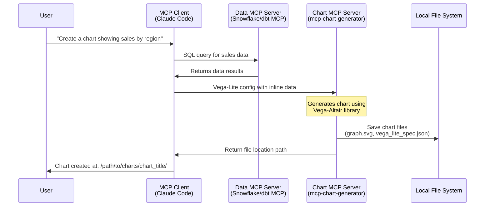

# mcp-chart-generator

This repository contains the code for a MCP server that allow clients (eg. Claude Code) to
generate charts that are saved to file artefacts for versionning and auditing capabilites.

This MCP server is built in Python using Vega-Altair library, so it can use Vega-Lite syntax.

A single tool call creates a folder where are saved : Input data, Vega-Lite specification and output chart
(SVG, PNG and PDF supported).

## Architecture

The following diagram shows the typical interaction flow between an MCP client (like Claude Code) and multiple MCP
servers for data-driven chart generation:



## Installation & Configuration

### Using uvx (Recommended)

Add this to your MCP configuration file:

```json
{
  "mcpServers": {
    "mcp-chart-generator": {
      "command": "uvx",
      "args": [
        "--from",
        "git+https://github.com/tucared/mcp-chart-generator",
        "mcp-chart-generator",
        "--output-dir",
        "/path/to/your/charts"
      ]
    }
  }
}
```

**Configuration Options:**

- `--output-dir` (required): Directory where generated charts will be saved
- `--output-format` (optional): Default output format - `svg` (default), `png`, or `pdf`

### Alternative: Local Development Setup

For local development or if you prefer to clone the repository:

1. Clone the repository:

   ```bash
   git clone https://github.com/tucared/mcp-chart-generator
   cd mcp-chart-generator
   ```

2. Install dependencies:

   ```bash
   uv sync
   ```

3. Add to MCP config:

   ```json
   {
     "mcpServers": {
       "mcp-chart-generator": {
         "command": "uv",
         "args": [
            "--directory",
            "/absolute/path/to/mcp-chart-generator",
            "run",
            "mcp-chart-generator",
            "--output-dir",
            "/path/to/your/charts"
          ],
         "cwd": "/absolute/path/to/mcp-chart-generator"
       }
     }
   }
   ```

**Note**: Replace `/absolute/path/to/mcp-chart-generator` with your actual path and
`/path/to/your/charts` with your desired output directory. Use `--output-format` to set the default format.

## Usage

### Generated Files

Each chart generation creates:

- Chart file: `graph.[format]` (svg/png/pdf)
- Specification: `vega_lite_spec.json`
- Directory: Named after sanitized chart title

## Contributing

### Setup

Install pre-commits:

```shell
uv run pre-commit install
```

### Inspecting

To inspect the MCP server, use the dedicated tool:

```shell
npx @modelcontextprotocol/inspector uv run mcp-chart-generator
```

### Testing

To verify the MCP server functionality, run the test:

```shell
uv run tests/test_chart_generate.py
```

## Acknowledgment

I wanna give a shout to [Issac Wasserman](https://github.com/isaacwasserman) who created a very similar MCP ([mcp-vegalite-server](https://github.com/isaacwasserman/mcp-vegalite-server/tree/main))
where essentially graphs are non persistent, where the present implementation focuses
on making implementation persist as artefacts in the repo.
